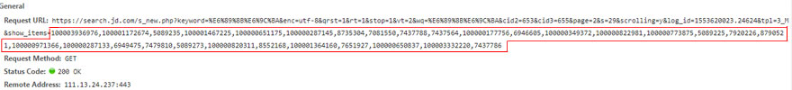
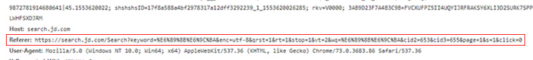

# 京东爬虫
 
#### 京东官网 - https://www.jd.com
|Author|Gobi Xu|
|---|---|
|Email|xusanity@aliyun.com|
****
## 声明
#### 任何内容都仅用于学习交流，请勿用于任何商业用途。
## 前言
#### 简单说明
- **请求时不需要携带cookies（即不需要先登录），过程相对轻松**
## 运行环境
#### Version: Python3
## 安装依赖库
```
pip install scrapy
```
## 细节
- **商品列表页是异步加载的**
###### 商品列表页的每一页都有60个商品，但是请求商品列表页时，只会显示前30个商品，剩下的30个商品是下滑商品列表页时异步加载出来的
###### 使用抓包的方法可以截取到剩下的30个商品的请求地址，请求地址尾部包含了前30个商品的商品id，头部信息里的Referer为商品列表页的请求地址

<br><br>

## 类目
#### :telephone_receiver:[手机](https://search.jd.com/Search?keyword=%E6%89%8B%E6%9C%BA&enc=utf-8&wq=&pvid=e7b33af1d11d4f70b6d8bdfb8fc7be87)
#### 爬取字段：
- **商品id (id)**
- **商品标题 (title)**
- **商品详情页网址 (url)**
- **商品的网店名称 (shop_name)**
- **商品价格 (price)**
- **商品牌子 (brand)**
- **商品型号 (model)**
- **商品评论数量 (comment_count)**
- **商品好评数 (good_count)**
- **商品中评数 (general_count)**
- **商品差评数 (poor_count)**
- **商品展示数 (show_count)**
## 最后
- **对应的spider里有大量注释，请放心食用:meat_on_bone:**
- **对应的类目在items.py里**
- **如有任何问题都可以邮箱:email:联系我，我会尽快回复你。**
